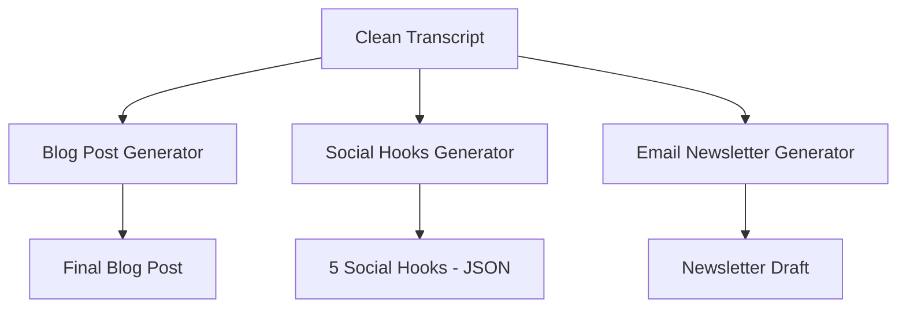

# Lesson 4.1: Meta-Prompting & Prompt Chaining

[](https://colab.research.google.com/github/vinod-seth/Prompt-Engineering-Mastery/blob/main/tutorial/07-meta-chaining.mdx)


A pattern that shows up constantly: someone asks a model to take a 30-minute meeting transcript and simultaneously clean it up, extract action items, write a summary blog post, generate social media hooks, AND draft a follow-up email. The result? A mediocre blob that does everything poorly and nothing well.

The model isn't failing because it's stupid — it's failing because you're asking it to juggle five cognitive tasks in a single context window. Imagine asking a human to simultaneously translate a document, fact-check it, redesign its layout, write a cover letter about it, AND compose a tweet — all at the same time, on one sheet of paper.

**Prompt Chaining** solves this by breaking complex workflows into a pipeline of specialized, sequential prompts — where each step does one thing excellently, and its output feeds the next step.

**Meta-Prompting** takes it further: using AI to write, optimize, and improve your prompts themselves.

**📍 Lesson Roadmap:**

| Section | Audience |
|:---|:---|
| 1. Prompt Chaining & Pipelines | 🟢 Everyone |
| 2. Python Pipeline Example | 🔷 Technical — Python SDK code |
| 3. Branching & Parallel Pipelines | 🔷 Technical — Python with asyncio |
| 4. Meta-Prompting | 🟢 Everyone |
| 5. Orchestration Frameworks | 🟢 Everyone |
| Concept Check | 🟢 Everyone |

---

## 🟢 1. Prompt Chaining: Linear Pipelines

Prompt Chaining is the practice of connecting multiple prompts in sequence, where the output of Prompt N becomes the input to Prompt N+1.


### Why Chaining Beats Single-Prompt

| Factor | Single Mega-Prompt | Chained Pipeline |
|:---|:---|:---|
| **Quality** | Each sub-task gets diluted attention | Each step gets full model focus |
| **Debuggability** | If output is wrong, where's the bug? | Inspect each step's input/output |
| **Token efficiency** | Repeating instructions inflates prompt size | Each prompt is lean and specific |
| **Flexibility** | Change one thing, rewrite the whole prompt | Swap or upgrade individual steps |
| **Model routing** | Stuck with one model for everything | Use cheap models for simple steps, premium for complex ones |

## 🔷 2. Python Pipeline Example

Here's a real, working 3-stage pipeline using the OpenAI API:

```python
from openai import OpenAI
import json

client = OpenAI()

def run_prompt(system: str, user_input: str, model: str = "gpt-4o-mini", temp: float = 0.0) -> str:
    """Helper to run a single prompt step."""
    response = client.chat.completions.create(
        model=model,
        temperature=temp,
        messages=[
            {"role": "system", "content": system},
            {"role": "user", "content": user_input}
        ]
    )
    return response.choices[0].message.content

# ─── STAGE 1: Clean & Extract (Cheap model — simple task) ───
raw_transcript = open("meeting_transcript.txt").read()

clean_text = run_prompt(
    system="""You are a transcript editor. Clean the raw meeting transcript:
    - Remove filler words (um, uh, like, you know)
    - Fix grammar and punctuation
    - Remove off-topic tangents (small talk, jokes)
    - Preserve all substantive content verbatim
    Output only the cleaned transcript. No preamble.""",
    user_input=f"<transcript>{raw_transcript}</transcript>",
    model="gpt-4o-mini"  # Cheap model — this is a simple cleanup task
)

# ─── STAGE 2: Extract Topics & Action Items (Structured output) ───
extracted = run_prompt(
    system="""You are a meeting analyst. From the cleaned transcript, extract:
    1. Key topics discussed (with brief descriptions)
    2. Action items (task, assignee, deadline)
    3. Decisions made
    Output as JSON matching this schema:
    {"topics": [{"title": "str", "summary": "str"}],
     "action_items": [{"task": "str", "assignee": "str", "deadline": "str"}],
     "decisions": ["str"]}""",
    user_input=f"<transcript>{clean_text}</transcript>",
    model="gpt-4o"  # Better model — extraction requires understanding
)

# ─── STAGE 3: Generate Blog Post (Creative, needs quality) ───
blog_post = run_prompt(
    system="""You are a content strategist writing for a tech company blog.
    Write a 600-word blog post based on the meeting insights provided.
    - Use an engaging, professional tone
    - Include H2 headers for each major topic
    - Add a concluding call-to-action
    - Do NOT mention that this came from a meeting transcript""",
    user_input=f"<meeting_insights>{extracted}</meeting_insights>",
    model="gpt-4o",  # Premium model — creative writing quality matters
    temp=0.7  # Higher temperature for more engaging prose
)

print(blog_post)
```

> **💡 Pro Tip (Model Routing):** Notice how Stage 1 uses `gpt-4o-mini` ($0.15/1M input tokens) while Stages 2-3 use `gpt-4o` ($2.50/1M input tokens). This is **model routing** — using cheap models for simple tasks and premium models where quality matters. A typical pipeline can cut costs by 60-80% this way. You can also mix providers: use Gemini Flash for cleanup, Claude for analysis, and GPT-4o for creative writing.

---

## 🔷 3. Branching & Parallel Pipelines

Not all pipelines are linear. Sometimes Stage 1 feeds into multiple parallel Stage 2 prompts:



This is the architecture of the Capstone Project you'll build at the end of this course.

### Implementing Parallel Branches (Python with asyncio)

```python
import asyncio
from openai import AsyncOpenAI

client = AsyncOpenAI()

async def run_prompt_async(system: str, user_input: str, model: str = "gpt-4o", temp: float = 0.0) -> str:
    response = await client.chat.completions.create(
        model=model, temperature=temp,
        messages=[
            {"role": "system", "content": system},
            {"role": "user", "content": user_input}
        ]
    )
    return response.choices[0].message.content

async def generate_all_assets(clean_transcript: str):
    # Run 3 generators in parallel — much faster than sequential
    # return_exceptions=True prevents one failure from crashing the entire pipeline
    results = await asyncio.gather(
        run_prompt_async(system="Write a 600-word blog post...", user_input=clean_transcript, temp=0.7),
        run_prompt_async(system="Generate 5 social media hooks as JSON...", user_input=clean_transcript),
        run_prompt_async(system="Write an email newsletter...", user_input=clean_transcript, temp=0.5),
        return_exceptions=True  # Catch individual failures without killing all tasks
    )
    
    # Check each result for errors
    for i, result in enumerate(results):
        if isinstance(result, Exception):
            print(f"Stage 2 branch {i} failed: {result}")
            results[i] = None  # Replace with None or a fallback
    
    blog, hooks, newsletter = results
    return blog, hooks, newsletter
```

---

## 🟢 4. Meta-Prompting: AI That Writes Prompts

**Meta-Prompting** is using an LLM to generate, critique, or optimize prompts. Instead of manually iterating on prompt wording, you ask a model to act as a "Prompt Engineer."

This is surprisingly effective — LLMs have seen millions of prompts in their training data, so they have strong intuitions about what works.

### Example: Generate a System Prompt

```text
You are an expert prompt engineer. I need a system prompt for the following use case:

USE CASE: I'm building a tool that extracts invoice details from uploaded PDFs.
The extracted data feeds into a PostgreSQL database.

REQUIREMENTS:
- The system prompt should define a clear role
- Use XML delimiters to separate the PDF text from instructions
- Output must be strict JSON matching a schema I'll provide
- Include guardrails for: missing fields, non-invoice documents, multiple invoices in one PDF
- Include safety rules against prompt injection

Write the complete system prompt. Be specific and production-ready.
```

### Example: Critique and Improve an Existing Prompt

```text
You are a prompt engineering auditor. Review the following prompt and identify weaknesses.
For each weakness, explain the risk and suggest a specific fix.

<prompt_to_review>
You are a helpful assistant. Read the document and extract the important information.
Return the results as JSON.
</prompt_to_review>

Score this prompt on:
1. Role specificity (1-5)
2. Output format clarity (1-5)
3. Edge case handling (1-5)
4. Security (1-5)
5. Reproducibility (1-5)

Then rewrite it as an improved version.
```

> **⚠️ Common Mistake:** Don't blindly trust meta-generated prompts. They're a starting point, not a finished product. Always test the generated prompt against your actual data and edge cases. I've seen meta-prompting produce beautifully structured prompts that completely fail on real-world inputs because the AI optimized for "looking professional" rather than "handling messy data."

---

## 🟢 5. Orchestration Frameworks

For production pipelines, you don't need to write all the boilerplate yourself. Several frameworks handle prompt chaining, model routing, and error handling:

| Framework | What It Does | Best For |
|:---|:---|:---|
| **[LangChain](https://python.langchain.com)** | Chains, agents, RAG, tool use, memory | General-purpose LLM applications |
| **[LlamaIndex](https://www.llamaindex.ai)** | Data ingestion, indexing, RAG pipelines | Document Q&A and knowledge bases |
| **[Instructor](https://github.com/jxnl/instructor)** | Structured output extraction | Schema-enforced data extraction |
| **[Google Vertex AI Pipelines](https://cloud.google.com/vertex-ai)** | Managed ML + LLM pipelines | Enterprise, managed infrastructure |
| **[CrewAI](https://www.crewai.com)** | Multi-agent orchestration | Complex tasks needing role-based agents |

You don't *need* a framework — the raw API examples earlier in this lesson work perfectly for most use cases. But if you're building something with multiple steps, error handling, retries, and logging, a framework saves significant boilerplate.

---

## 🟢 Concept Check

**Scenario:** You're processing 500 customer feedback surveys daily. The pipeline has 3 stages: (1) clean raw text, (2) classify sentiment, (3) generate a management summary. Stage 1 and 2 are straightforward; Stage 3 requires nuanced writing. You want to minimize API costs. What's the optimal model routing strategy?

* [ ] **A)** Use GPT-4o for all three stages for maximum quality.
* [ ] **B)** Use GPT-4o-mini for all three stages for minimum cost.
* [x] **C)** Use GPT-4o-mini for Stages 1-2 (cleanup + classification) and GPT-4o for Stage 3 (creative summary).
* [ ] **D)** Use a single mega-prompt to eliminate the overhead of multiple API calls.

<details>
<summary><b>🔑 Click to Reveal Answer & Explanation</b></summary>

**Correct Answer: C**

**Explanation:** This is model routing in action. Stages 1 and 2 are deterministic, structured tasks (text cleanup and classification) — cheap models like GPT-4o-mini, Gemini Flash, or Claude Haiku handle these with near-identical accuracy to premium models. Stage 3 (management summary) requires nuanced writing quality, justifying a premium model. At 500 surveys/day, routing Stages 1-2 to a mini model can cut your API costs by 70%+ while maintaining output quality where it matters. Answer D (mega-prompt) would actually *increase* costs because you'd need a premium model for the entire bloated prompt.
</details>

---

## 📚 References & Further Reading

- **LangChain Documentation**: [python.langchain.com/docs](https://python.langchain.com/docs)
- **LlamaIndex Documentation**: [docs.llamaindex.ai](https://docs.llamaindex.ai)
- **Wu et al. (2023)**: *"AutoGen: Enabling Next-Gen LLM Applications via Multi-Agent Conversation"* — Microsoft's multi-agent framework paper
- **Model Pricing Comparison**: [OpenAI Pricing](https://openai.com/pricing), [Anthropic Pricing](https://www.anthropic.com/pricing), [Google AI Pricing](https://ai.google.dev/pricing)
- **Prompt Chaining Patterns**: Anthropic's guide on [chaining complex prompts](https://docs.anthropic.com/en/docs/build-with-claude/prompt-engineering/chain-prompts)

---

## 🚀 What's Next?

You've built the pipeline. But how do you know it's actually *good*? A prompt that works on your 5 test cases might fail catastrophically on the 500th real-world input. In the next lesson, we learn to systematically test, score, and iterate on prompts — including using one AI model to evaluate another.

* [Lesson 4.2: Evaluation & Iteration →](./08-evaluation-iteration.mdx)
---

## 📝 Chapter Quiz

**Question 1:** What is the primary goal of Meta-Chaining in Generative AI development?

* [ ] To modify model weights directly
* [x] To design effective inputs that guide Large Language Models to produce accurate, context-aware responses
* [ ] To build hardware GPU clusters
* [ ] To train models from scratch

<details>
<summary>🔑 Click to Reveal Answer & Explanation</summary>

**Correct Answer:** To design effective inputs that guide Large Language Models to produce accurate, context-aware responses

**Explanation:** Meta-Chaining optimizes communication with LLMs without retraining underlying parameters.
</details>

**Question 2:** Which prompting technique involves providing explicit input-output examples inside the prompt?

* [ ] Zero-Shot Prompting
* [x] Few-Shot Prompting
* [ ] Meta Prompting
* [ ] Negative Prompting

<details>
<summary>🔑 Click to Reveal Answer & Explanation</summary>

**Correct Answer:** Few-Shot Prompting

**Explanation:** Few-Shot prompting supplies concrete demonstration pairs to guide model formatting and reasoning style.
</details>

**Question 3:** What does the phrase 'Let's think step by step' trigger when added to a prompt?

* [ ] Random generation
* [x] Zero-Shot Chain-of-Thought reasoning
* [ ] Model shutdown
* [ ] JSON extraction mode

<details>
<summary>🔑 Click to Reveal Answer & Explanation</summary>

**Correct Answer:** Zero-Shot Chain-of-Thought reasoning

**Explanation:** This phrase encourages models to generate intermediate reasoning steps, improving complex problem-solving accuracy.
</details>

**Question 4:** Why are XML tags or clear delimiters used in structured prompts?

* [ ] To make prompts look longer
* [x] To clearly delineate system instructions, user context, and untrusted inputs for security and clarity
* [ ] To compile code to HTML
* [ ] They are ignored by models

<details>
<summary>🔑 Click to Reveal Answer & Explanation</summary>

**Correct Answer:** To clearly delineate system instructions, user context, and untrusted inputs for security and clarity

**Explanation:** Delimiters isolate input sections, preventing ambiguity and protecting against prompt injection.
</details>

**Question 5:** What is an LLM 'hallucination'?

* [ ] Fast token generation
* [x] A response where the model generates plausible-sounding but factually incorrect or ungrounded information
* [ ] A network connection error
* [ ] An API rate limit error

<details>
<summary>🔑 Click to Reveal Answer & Explanation</summary>

**Correct Answer:** A response where the model generates plausible-sounding but factually incorrect or ungrounded information

**Explanation:** Hallucinations occur when models output incorrect information with high confidence due to probabilistic token generation.
</details>

**Question 6:** Which decoding hyperparameter controls randomness and creativity in model output?

* [ ] max_tokens
* [x] Temperature
* [ ] frequency_penalty
* [ ] presence_penalty

<details>
<summary>🔑 Click to Reveal Answer & Explanation</summary>

**Correct Answer:** Temperature

**Explanation:** Temperature scales logit probabilities; lower values produce deterministic output, higher values increase variety.
</details>

**Question 7:** What is Retrieval-Augmented Generation (RAG)?

* [ ] Fine-tuning models on raw text
* [x] Dynamically fetching relevant documents from external data stores and injecting them into the LLM prompt context
* [ ] Compressing prompt text into zip files
* [ ] Generating images from prompts

<details>
<summary>🔑 Click to Reveal Answer & Explanation</summary>

**Correct Answer:** Dynamically fetching relevant documents from external data stores and injecting them into the LLM prompt context

**Explanation:** RAG enhances model accuracy by grounding responses in external, real-time authoritative knowledge bases.
</details>

**Question 8:** How can developer teams ensure structured JSON output from LLM API calls?

* [ ] Hoping the model formats it correctly
* [x] Enforcing Structured Outputs via Pydantic schemas or API function calling features
* [ ] Increasing temperature to maximum
* [ ] Using short prompts

<details>
<summary>🔑 Click to Reveal Answer & Explanation</summary>

**Correct Answer:** Enforcing Structured Outputs via Pydantic schemas or API function calling features

**Explanation:** Constrained decoding and Function Calling APIs guarantee that outputs strictly adhere to target JSON schemas.
</details>
