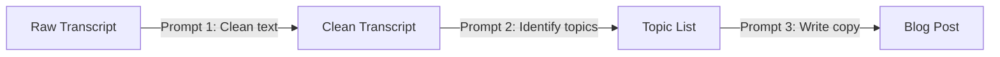

# Lesson 4.1: Meta-Prompting & Prompt Chaining

When building real-world software integrations, tasks are often too complex for a single prompt. If you ask an LLM to take an raw meeting transcript and instantly write a blog post, extract project tasks, and draft an email newsletter all in one prompt, the model will output low-quality, generic results.

The solution is **Prompt Chaining**: breaking down a massive task into a linear sequence of smaller, specialized prompts.

---

## 1. What is Prompt Chaining?

Prompt Chaining is the practice of passing the output of one prompt as the input to the next prompt. 



### Why Chaining Wins:
1. **Focus:** Each model run focuses on a single, clear operation.
2. **Token Economy:** You don't waste tokens asking the model to perform multiple heavy cognitive tasks in a single cycle.
3. **Debugging:** If the final output is bad, you can pinpoint exactly which step in the chain failed.

---

## 2. Meta-Prompting: AI Writing Prompts

**Meta-Prompting** is using an LLM to generate or optimize prompts for you. 

Instead of guessing what instructions will get the best results, you can prompt a model (like Gemini) acting as a "Prompt Engineer" to craft the perfect System Instruction for your target task.

### Example Meta-Prompt
```text
You are an expert prompt engineer. I want to build a tool that extracts invoices from PDFs. 
Write a highly structured System Prompt that instructs a model to perform this task. 
Include XML delimiters, strict JSON schemas, and safety guardrails for missing fields.
```

---

## 3. Creating a Multi-Stage Pipeline

To build a content pipeline, you write a Python script that orchestrates the chain. Here is the conceptual flow:

1. **Step 1 (Clean):** Input raw speech transcript -> output clean formatted text.
2. **Step 2 (Extract):** Input clean text -> output JSON file of key talking points.
3. **Step 3 (Generate):** Input JSON talking points -> output a draft email newsletter.

---

### ✍️ Concept Check

**Question:** Why is it better to chain prompts rather than sending one massive prompt containing all instructions?

* [ ] **A)** Because chaining is the only way to activate high temperature settings.
* [x] **B)** Because breaking a complex task into isolated stages reduces cognitive load on the token predictor, leading to higher accuracy and easier troubleshooting.
* [ ] **C)** Because chaining prompts decreases the overall latency of the pipeline.
* [ ] **D)** Because single prompts cannot handle XML delimiters.

<details>
<summary><b>🔑 Click to Reveal Answer & Explanation</b></summary>

**Correct Answer: B**

**Explanation:** Chaining isolates tasks so the model doesn't have to divide its attention between cleaning text, formatting tables, and drafting creative copy simultaneously. This drastically improves output quality and makes errors easy to isolate.
</details>

---

## 🚀 What's Next?
Now that you know how to build prompt pipelines, let's explore how to test, iterate, and evaluate your prompt designs before deploying them.

* [Lesson 4.2: Evaluation & Iteration](https://github.com/vinod-seth/Prompt-Engineering-Mastery/blob/main/tutorial/08-evaluation-iteration.mdx)
